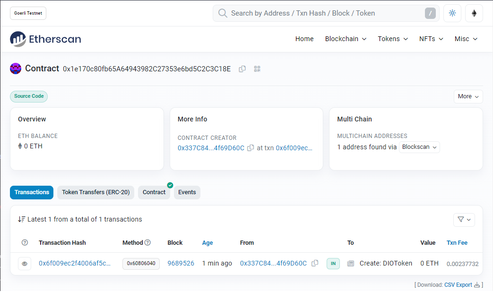

# DIO - Blockchain Specialist Training

Project Challenge - Creating your first cryptocurrency on the Ethereum Network

## How to Run 🏃

1. open https://remix.ethereum.org
2. create a new token.sol file
3. copy and paste the content from repo
4. compile & deploy
5. test

Contract published on [Goerli](https://goerli.etherscan.io/address/0x1e170c80fb65a64943982c27353e6bd5c2c3c18e)

    

## License 📄

Code released under the [MIT License](./LICENSE).

Make by [Leonardo Cairo](https://www.linkedin.com/in/leocairos/)!